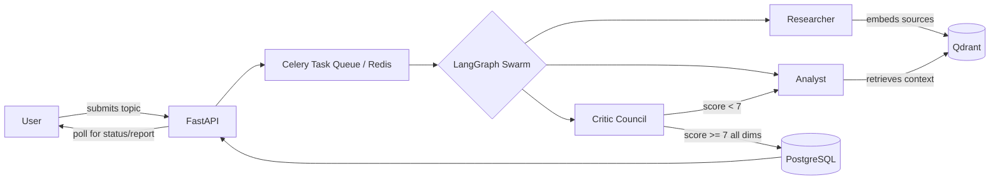

<div align="center">

# Decentralized AI Research Swarm Platform

**A multi-agent research system that gathers, drafts, and self-critiques full research reports — with a tiered cloud-to-local fallback chain that keeps it running when providers fail.**

[](https://www.python.org/)
[](https://fastapi.tiangolo.com/)
[](https://langchain-ai.github.io/langgraph/)
[](https://react.dev/)
[](https://supabase.com/)
[](https://www.docker.com/)
[](#license)

</div>

---

## Table of Contents

- [Overview](#overview)
- [Architecture](#architecture)
- [Key Features](#key-features)
- [Tech Stack](#tech-stack)
- [Project Structure](#project-structure)
- [Getting Started](#getting-started)
- [Configuration](#configuration)
- [API Reference](#api-reference)
- [Roadmap](#roadmap)
- [Team](#team)
- [License](#license)

---

## Overview

The platform accepts a research topic and orchestrates a swarm of specialized LLM agents to produce a fact-checked, source-cited report with no human intervention in the loop:

| Stage | Agent | Responsibility |
|---|---|---|
| 1 | **Researcher** | Searches the live web, scrapes and chunks results, embeds them into a vector store |
| 2 | **Analyst** | Retrieves relevant context and drafts a structured Markdown report |
| 3 | **Critic Council** | Two independent models score the draft (0–10) on accuracy, source coverage, logic, and citations |

A report is only released once every scoring dimension clears a fixed threshold; a failing score routes the draft back to the Analyst for revision, bounded by a maximum retry count to guarantee termination. Every scoring round is retained, so the final report ships with a full, auditable revision history — not just a pass/fail stamp.

Reliability is handled at the infrastructure level: each agent is backed by a three-tier fallback chain (primary cloud provider → secondary cloud provider → local model via Ollama), so a rate limit or outage on one provider degrades gracefully instead of failing the run.

## Architecture



Each agent call is wrapped by a circuit breaker: on failure it falls through **Tier 1 (primary cloud) → Tier 2 (secondary cloud) → Tier 3 (local Ollama)** before the task is marked failed.

## Key Features

- **Self-correcting report generation** — a bounded critique-and-revise loop instead of a single-pass draft.
- **Tiered fallback resilience** — cloud-to-local degradation keeps the pipeline running through provider outages or rate limits.
- **Full audit trail** — every critic score and revision is persisted and surfaced in the final report, not discarded after the run.
- **Live execution visibility** — a real-time view of which agent is active and what it's doing, polled from a persisted event log.
- **Source-grounded output** — every claim traces back to a retrievable, clickable source.

## Tech Stack

| Layer | Technology |
|---|---|
| Agent Orchestration | LangGraph (state machine) |
| Background Processing | Celery, Redis |
| API | FastAPI |
| Relational Database | PostgreSQL (Supabase) |
| Vector Store | Qdrant |
| LLM Providers | Groq, OpenRouter (free-tier models), Ollama (local fallback) |
| Web Search | Tavily, DuckDuckGo (fallback) |
| Frontend | React, Vite, Tailwind CSS |
| Authentication | JWT |
| Containerization | Docker, Docker Compose |

## Project Structure

```
decentralized-ai-swarm/
├── docker-compose.yml
├── .env
├── README.md
│
├── backend/
│   ├── Dockerfile
│   ├── requirements.txt
│   ├── alembic.ini
│   ├── alembic/versions/
│   └── app/
│       ├── main.py                  # FastAPI entry point & CORS config
│       ├── core/                    # config, DB session, JWT security, Celery app
│       ├── models/                  # SQLAlchemy schemas (users, research)
│       ├── schemas/                 # Pydantic request/response validation
│       ├── api/v1/                  # auth, research routes
│       ├── services/                # Qdrant, search (Tavily/DuckDuckGo), OpenRouter client
│       │                            #   (multi-model routing + circuit breaker + Redis cache)
│       ├── tasks/                   # rate-limited Celery tasks invoking the swarm
│       └── swarm/                   # LangGraph engine: state, graph, and agent nodes
│           └── nodes/
│               ├── researcher.py
│               ├── analyst.py
│               └── critic.py
│
└── frontend/
    ├── Dockerfile
    ├── package.json
    └── src/
        ├── components/              # Navbar, SwarmVisualizer, ReportRenderer
        ├── pages/                   # Login, Dashboard, Workspace
        └── services/api.js          # auth + job submission + polling
```

## Getting Started

### Prerequisites

- Docker and Docker Compose
- A managed PostgreSQL instance (Supabase or equivalent)
- API credentials for Groq, OpenRouter, and Tavily

### Installation

```bash
# 1. Clone the repository
git clone https://github.com/Kunal-t20/Decentralised_Swarm_AI_Research_Platform.git
cd decentralized-ai-swarm

# 2. Configure environment variables
cp .env.example .env
# populate DATABASE_URL, GROQ_API_KEY, OPENROUTER_API_KEY, TAVILY_API_KEY, SECRET_KEY

# 3. Launch the stack
docker compose up

# 4. Apply database migrations
cd backend
alembic upgrade head
```

### Access Points

| Service | URL |
|---|---|
| Frontend | `http://localhost:3000` |
| Backend API | `http://localhost:8000` |
| Health Check | `http://localhost:8000/api/v1/health` |

## Configuration

All runtime configuration is environment-driven. Required variables:

| Variable | Description |
|---|---|
| `DATABASE_URL` | PostgreSQL connection string |
| `REDIS_URL` | Redis connection string |
| `QDRANT_URL` | Qdrant instance URL |
| `GROQ_API_KEY` | Groq API key (Tier 1 inference) |
| `OPENROUTER_API_KEY` | OpenRouter API key (Tier 2 inference) |
| `TAVILY_API_KEY` | Tavily search API key |
| `OLLAMA_BASE_URL` | Ollama instance URL (Tier 3 local fallback) |
| `SECRET_KEY` | JWT signing secret |
| `ACCESS_TOKEN_EXPIRE_MINUTES` | JWT expiry window |
| `CORS_ORIGINS` | Allowed frontend origin(s) |

## API Reference

| Method | Endpoint | Description |
|---|---|---|
| `POST` | `/api/v1/auth/register` | Create a user account |
| `POST` | `/api/v1/auth/login` | Authenticate and receive a JWT |
| `POST` | `/api/v1/research` | Submit a new research topic |
| `GET` | `/api/v1/research/{id}` | Poll job status and incremental execution log |
| `GET` | `/api/v1/research/{id}/report` | Retrieve the completed report, sources, and audit trail |
| `GET` | `/api/v1/research` | List all research jobs for the authenticated user |
| `DELETE` | `/api/v1/research/{id}` | Delete a research job and its report |
| `GET` | `/api/v1/health` | Aggregate health of all downstream services |

## Roadmap

- [x] **Phase 1** — Infrastructure: Docker Compose, Supabase integration, Alembic migrations
- [ ] **Phase 2** — Agent services: multi-model client, circuit breaker, search fallback
- [ ] **Phase 3** — LangGraph state machine
- [ ] **Phase 4** — Celery task pipeline and API layer
- [ ] **Phase 5–7** — Frontend: Dashboard, Workspace, Report view
- [ ] **Phase 8–9** — Integration testing, deployment

## Team

| Name | Role |
|---|---|
| **Kunal Mahajan** | Backend & AI — FastAPI backend, PostgreSQL/Redis/Qdrant integration, Celery, LangGraph swarm, Researcher/Analyst/Critic agents, LLM provider routing and resilience, RAG/search pipeline, and AI orchestration |
| **Prathamesh Kuldharan** | QA & Testing — Unit testing, integration testing, end-to-end testing, failure/chaos testing, API validation, database/service testing, bug tracking, and final system verification |
| **Pankaj Mhetre** | Frontend — React + Vite dashboard, Login, Dashboard, Workspace, SwarmVisualizer, research job interface, report rendering, sources/audit UI, and frontend-backend integration |

## License

Academic project, developed for graduation coursework. License terms to be finalized.